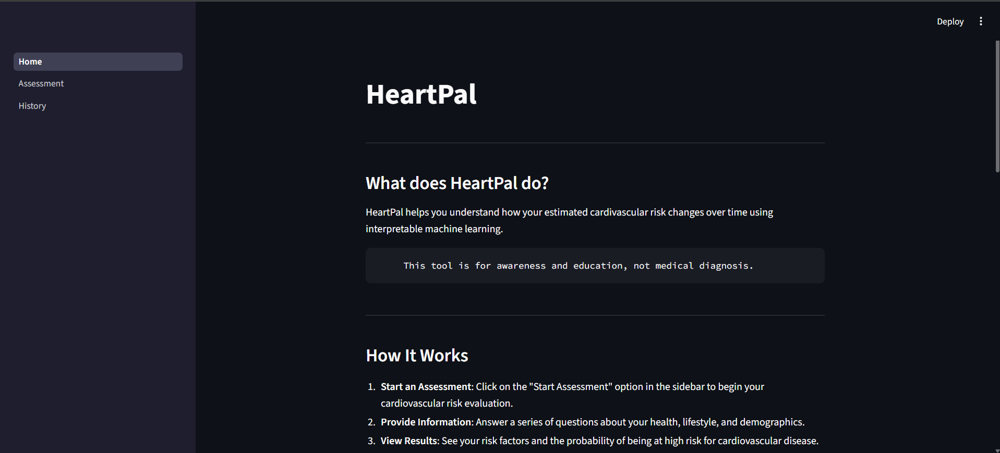
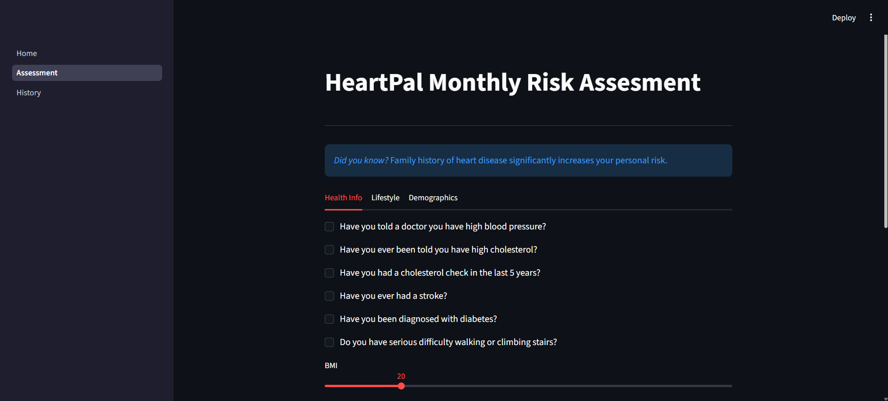

# HeartPal

**Version:** v1.0.1 (Bug Fixes)

### _Small check-ins, big difference._

HeartPal is a cardiovascular risk awareness tool built with Python and Streamlit. It uses a logistic regression model trained on real health data to estimate your heart disease risk and track how it changes over time.

---

## Demo

### Home Page



### Assessment Page



---

## Why I Built This

Heart disease runs in my family. Watching my dad manage his health made me realize how little most people understand about their own cardiovascular risk — and how small lifestyle changes, tracked consistently, can actually make a difference.

HeartPal isn't a medical tool. It's an awareness tool. Something you check once a month, see your risk score, and understand which factors are driving it.

---

## Features

- **Monthly risk assessment** — 21-question health questionnaire covering lifestyle, medical history, and demographics
- **ML-powered scoring** — logistic regression model trained on the CDC BRFSS dataset
- **Personalized risk factors** — shows which of your inputs are contributing most to your score
- **Risk history chart** — tracks your score over time so you can see progress
- **Lightweight and private** — no accounts, no passwords, just your name

---

## Tech Stack

- Python
- Streamlit
- scikit-learn (Logistic Regression)
- SQLite
- Plotly
- pandas / NumPy

---

## Running Locally

```bash
git clone https://github.com/yourusername/HeartPal.git
cd HeartPal
pip install -r requirements.txt
python -m streamlit run Home.py
```

---

## Dataset

Trained on the [CDC BRFSS Health Indicators Dataset](https://www.kaggle.com/datasets/alexteboul/heart-disease-health-indicators-dataset) — a survey of over 250,000 Americans on health behaviors and conditions.

---

## Disclaimer

HeartPal is for educational and awareness purposes only. It is not a substitute for professional medical advice, diagnosis, or treatment.

---

## Notes

- First load of the questionnaire may take slightly longer due to model initialization. Subsequent loads are typically faster.

---

_Built for the 2025 Congressional App Challenge — Arizona's 1st Congressional District._
